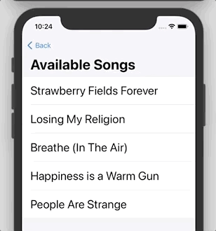

  [](https://github.com/apple/swift-package-manager)

# BricksAndTiles

🧱 A composable solution for building reusable lists in Swift/UIKit. As easy as playing with Legos.

  - [Features](#features)
    - [UITableView](#uitableview)
    - [UICollectionView](#uicollectionview)
    - [UITableView + UICollectionView](#uitableview--uicollectionview)
  - [Installation](#installation)
      - [Swift Package Manager](#swift-package-manager)
      - [CocoaPods](#cocoapods)
  - [Dependencies](#dependencies)
  - [Contributing](#contributing)
  - [Authors](#authors)

## Features

### UITableView
- [x] Static cells
- [x] Draggable cells


- [x] Cells with actions on slide



- [x] Single selection


### UICollectionView
- [x] Static collection cells


- [x] Grid collection cells


### UITableView + UICollectionView
- [x] Horizontal list cells


## Installation

_BricksAndTiles_ currently supports these installation options:

#### Swift Package Manager
The [Swift Package Manager](https://swift.org/package-manager/) is a tool for automating the distribution of Swift code and is integrated into the swift compiler.

Once you have your Swift package set up, adding BricksAndTiles as a dependency is as easy as adding it to the dependencies value of your `Package.swift`.

```swift
dependencies: [
    .package(
        url: "https://github.com/mugbug/BricksAndTiles.git", 
        from: "0.0.3"
    ),
]
```

If you're using SPM through Xcode:

1. Go to `File > Swift Packages > Add Package Dependency` 
2. Enter https://github.com/mugbug/BricksAndTiles
3. Choose a rule and submit.

#### CocoaPods
[CocoaPods](https://cocoapods.org) is a dependency manager for Cocoa projects. For usage and installation instructions, visit their website. To integrate BricksAndTiles into your Xcode project using CocoaPods, specify it in your Podfile:
```ruby
pod 'BricksAndTiles', '0.0.3'
```

BricksAndTiles is also available as subspecs:
- For only UITableView features:
```ruby
pod 'BricksAndTiles/TableView', '0.0.3'
```
- For only UICollectionView features:
```ruby
pod 'BricksAndTiles/CollectionView', '0.0.3'
```

## Dependencies

This package depends on [PaintAndBrush](https://github.com/mugbug/PaintAndBrush), which is a super lightweight package with helper extensions for building UIKit views in code.

## Contributing

Any kind of contributions would be highly appreciated! To start contributing, read the [Contributing Guideline](https://github.com/mugbug/BricksAndTiles/blob/master/CONTRIBUTING.md) for info on how to report issues, submit ideas and submit pull requests!

## Authors

- [@mugbug](https://github.com/mugbug)
- [@emmendesf](https://github.com/emmendesf)
